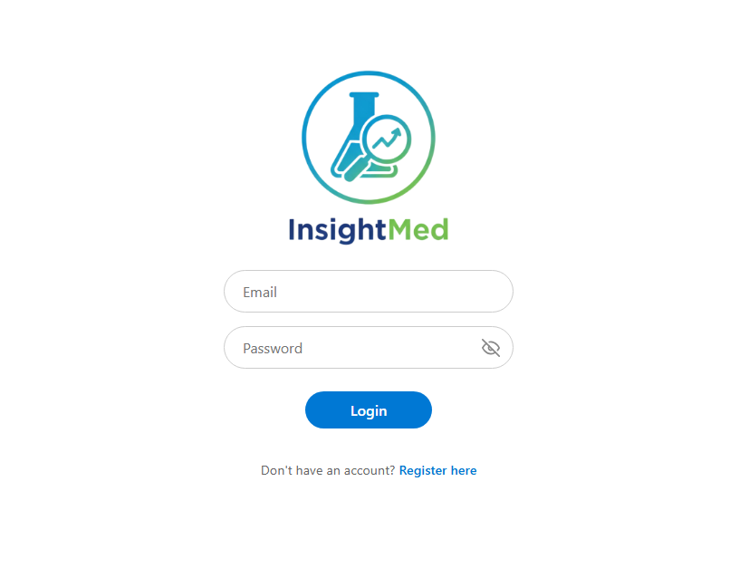
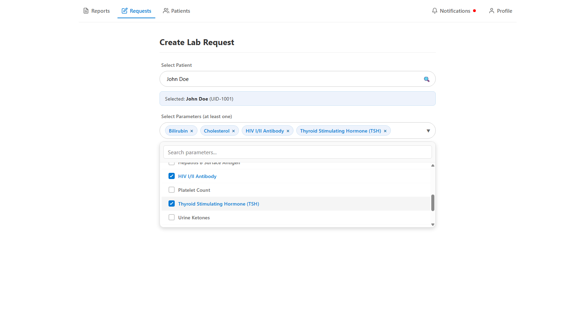
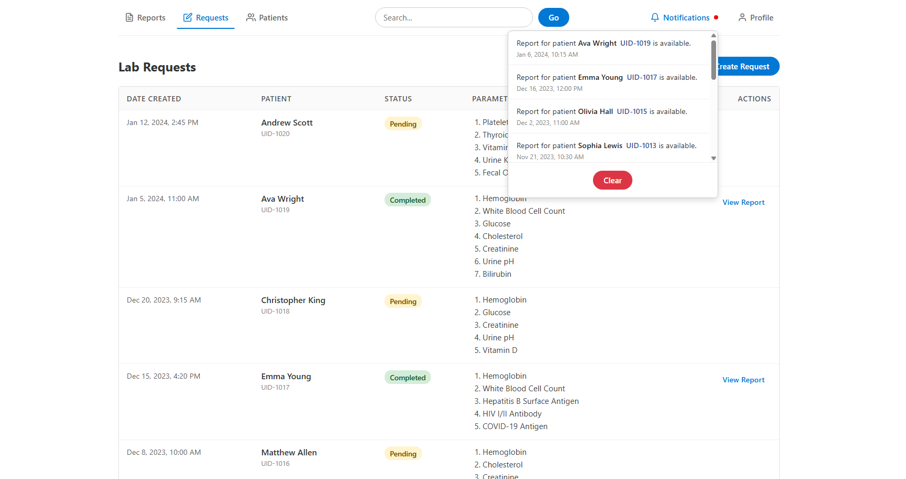
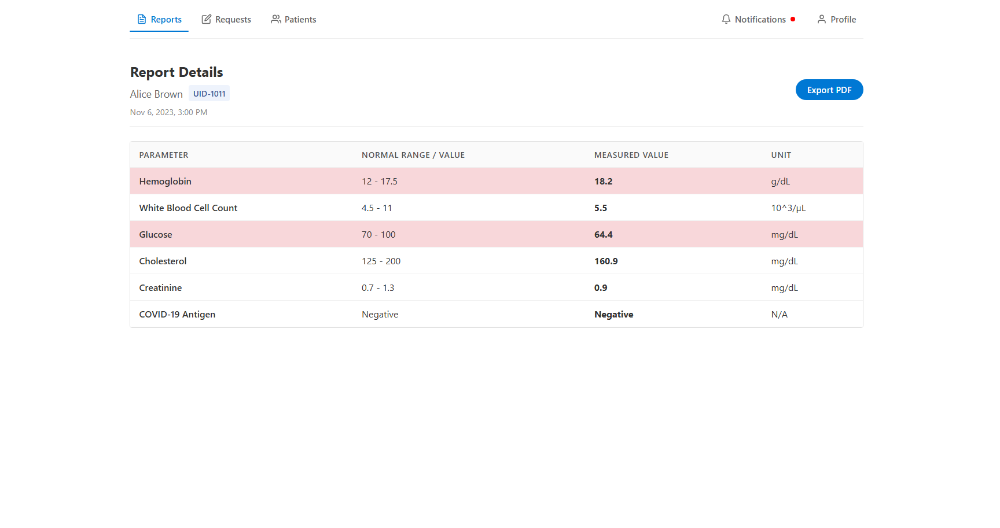
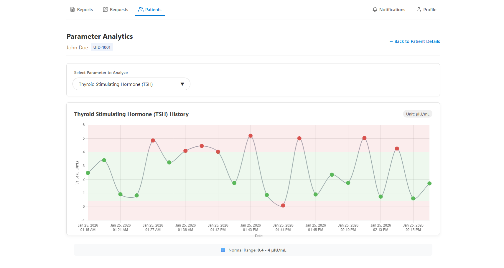
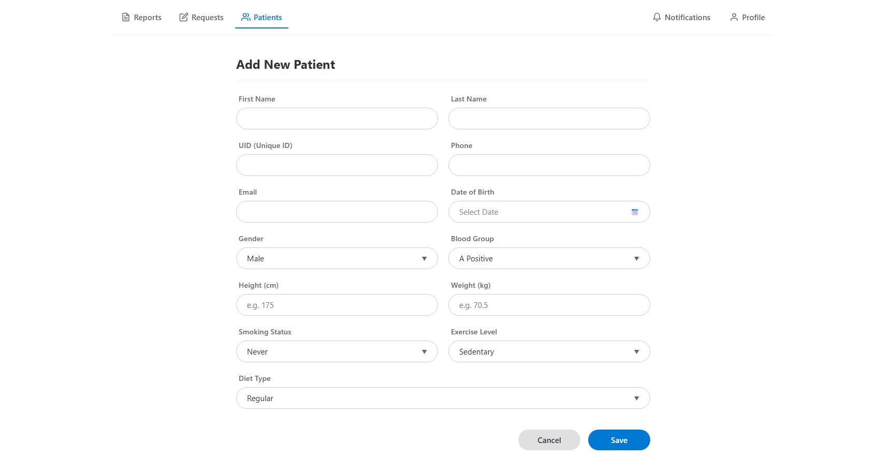
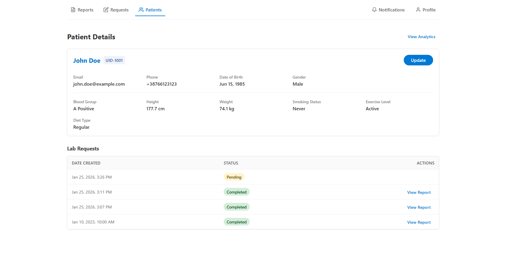

# Overview

 

## Introduction

_InsightMed_ is a demo medical application for managing laboratory reports
for patients. It simulates the typical workflow between doctors, patients,
and an external laboratory clinic.

A lab report represents the outcome of medical investigations requested
for a patient – for example, blood work, urine analysis, vitamin levels, or
tumor markers. In a real setting, these tests would be performed by a lab
clinic after the patient provides the necessary samples.

In _InsightMed_, this entire process is simulated:
- A doctor creates a lab order for a patient, choosing which tests or
  investigations need to be performed
- The order is sent to a simulated lab service, which acts like an
  external lab clinic
- The lab service “performs” the requested tests by generating realistic
  random results
- Once the results are ready, they are returned as a lab report that
  can be viewed by the doctor, as if they came from a real lab
- From the doctor’s perspective, this behaves as if the patient actually went to a physical lab,
  provided samples, and the clinic later returned the finalized lab report

Behaviour of these measurement results over time can be tracked through analytics page which provides an informational graph.  
The system also provides other set of functionalities such as report export and CRUD operations for related entities.  

 

## First look

The following screenshots can give an idea of basic UI look and some pages/elements that the end user might interact with.  

 

    

    

    

    

    

    

    

