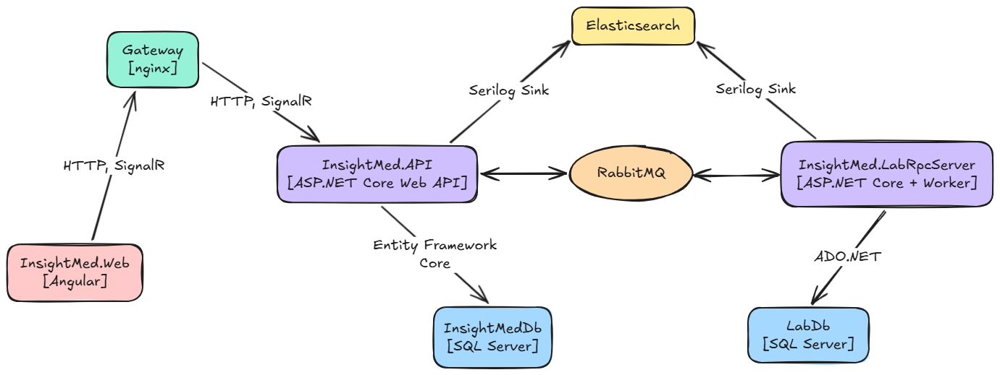
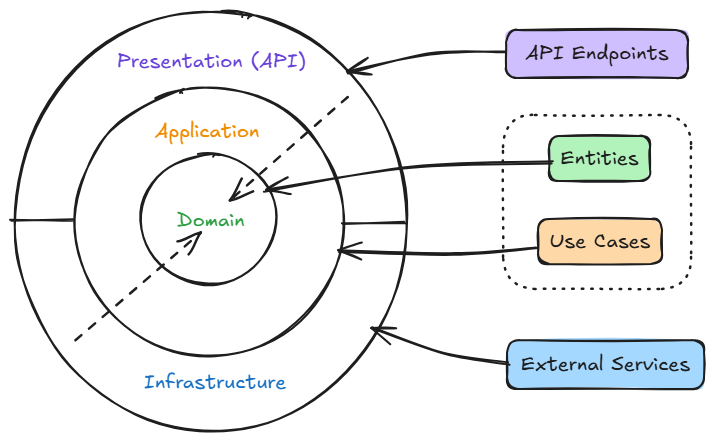

# Technical

 

## High-level look

_InsightMed_ is a distributed system built around a modular monolith core. The infrastructure consists of the
following dockerized components:
- _InsightMed.API_: [ASP.NET Core Web API](https://learn.microsoft.com/en-us/aspnet/core/web-api/?view=aspnetcore-10.0) (.NET 10)
- _InsightMed.Web_: [Angular](https://angular.dev/) Single Page Application (v21, Node.js v24)
- _InsightMed.LabRpcServer_: [.NET Worker Service](https://learn.microsoft.com/en-us/dotnet/core/extensions/workers) (.NET 10) acting as a simulated external laboratory system
- Databases: two distinct [SQL Server](https://www.microsoft.com/en-us/sql-server) instances
    - **InsightMedDb**: Main application database managed via [Entity Framework Core](https://learn.microsoft.com/en-us/ef/core/)
    - **LabDb**: Laboratory simulation database managed via [ADO.NET](https://learn.microsoft.com/en-us/dotnet/framework/data/adonet/ado-net-overview)
- Message Broker: [RabbitMQ](https://www.rabbitmq.com/) for asynchronous inter-service communication
- Observability: [Elasticsearch](https://www.elastic.co/elasticsearch) and [Kibana](https://www.elastic.co/kibana) for log aggregation and visualization

 

    

 

## Communication between components

The system uses different communication patterns to handle different requirements:
- RESTful HTTP: Standard request/response model used between the Web API and Angular frontend
- Real-Time with [SignalR](https://dotnet.microsoft.com/en-us/apps/aspnet/signalr): A persistent WebSocket connection between the Web API and Angular frontend to push notifications to the user without the need for polling
- [RPC Messaging with RabbitMQ](https://www.rabbitmq.com/tutorials/tutorial-six-dotnet): Used for bidirectional communication between the Web API and the Lab Worker Service

 

## Backend architecture

The backend solution, i.e. _InsightMed.API_ and associated class libraries follows Clean Architecture principles
combined with the CQRS (Command Query Responsibility Segregation) pattern using the [MediatR](https://mediatr.io/) library.  

The solution is partitioned into four primary layers:
- Domain
- Application
- Infrastructure
- API

 

    

 

**Domain** is the core of the application, containing entities and enums. Entities are just POCOs (Plain Old CLR Objects) and do not inherit from
base classes or depend on external frameworks.  

**Application** defines the busines logic and use cases. By the CQRS, logic is split into commands (writes) and queries (reads).
All requests pass through a MediatR pipeline that handles cross-cutting concerns before reaching the handler.
Currently in our case, we have:
- Validation behavior which uses [FluentValidation](https://docs.fluentvalidation.net/en/latest/) to validate DTOs. Throws exception and logs errors if validation fails
- Logging behavior which uses [Serilog](https://serilog.net/) and logs request/response performance and details  

[AutoMapper](https://automapper.io/) is utilized to map between domain entities and DTOs.  
This layer defines contracts for Infrastructure to implement.

**Infrastructure** implements interfaces defined in the Application layer.
Here we have:
- Data access: Implementation of the `AppDbContext`
- Messaging: Implementation of the `RabbitMqRpcClient`
- Services: Module-specific services that inject the `DbContext` to manipulate state. These act as a higher-level repository layer although
they are not limited only to state manipulation
- PDF Generation: Uses [QuestPDF](https://www.questpdf.com/) to generate lab reports pdf
- Authentication: Implementation of `AuthService` and `CurrentUserService`

**API** is the entry point of the application. It consists of:
- Controllers: Minimal logic, responsible for dispatching MediatR requests and returning standard HTTP responses
- Global exception handling: A dictionary-based `GlobalExceptionHandler` converts exceptions into standard `ProblemDetails` responses with appropriate HTTP status codes
- Hubs: Contains the `NotificationHub` for SignalR communication

 

## Data access strategy

The solution uses two distinct approaches for database interaction.  

- **InsightMedDb** (EF Core) is used by the main API with Code-First approach. Relationshipts are defined via Fluent API in `OnModelCreating` method.  
Database is created automatically on startup by execution of migration scripts and seeded via a specific API endpoint _[GET] api/AppManagement/SeedData_.  
- **LabDb** (ADO.NET) is used by the _LabRpcServer_. The approach consists of raw SQL via ADO.NET.  
The worker service ensures the database and tables exist and are seeded upon startup.

Use case of in-memory caching is also present, where `IMemoryCache` is utilized for lab parameters as this reference data changes rarely.

 

## Lab RPC Server (Worker Service)